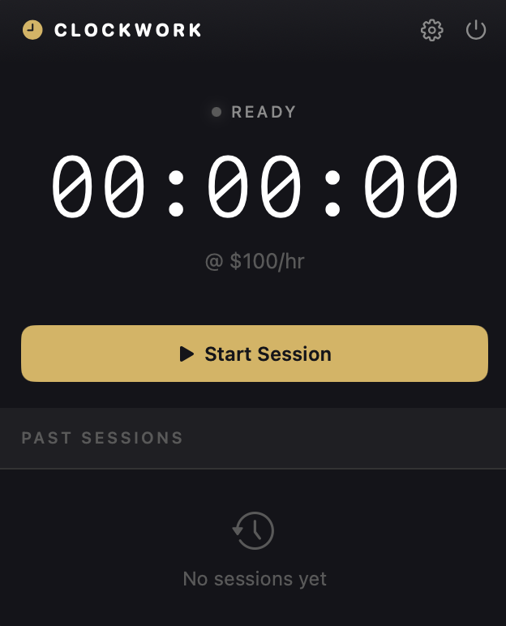

<p align="center">
  
</p>

# Clockwork

A minimal, elegant menubar time tracker for macOS. Track billable hours and earnings without leaving your workflow.


## Features

- **Menubar Native** — Lives in your menubar, always one click away
- **Start/Pause/Resume** — Flexible session control with accurate pause tracking
- **Earnings Calculator** — Set your hourly rate and watch earnings update in real-time
- **Session History** — View past sessions with duration and earnings
- **Persistent Storage** — Sessions and settings saved locally
- **Dark UI** — Refined dark interface with gold accents

## Requirements

- macOS 14.0 or later
- Xcode 15.0+ (for building from source)

## Installation

### Download

Download the latest release from the [Releases](../../releases) page.

#### Opening the App

This app is not signed with an Apple Developer certificate. macOS will block it the first time you open it. Follow these steps:

1. Double-click `clockwork.app` — macOS will show a warning and refuse to open it
2. Open **System Settings**
3. Go to **Privacy & Security**
4. Scroll down to the bottom — you'll see a message about "clockwork" being blocked
5. Click **Open Anyway**
6. Click **Open Anyway** again in the confirmation dialog
7. Enter your password when prompted

### Build from Source

```bash
git clone https://github.com/yourusername/clockwork.git
cd clockwork
open clockwork.xcodeproj
```

Then build and run with `⌘R` in Xcode.

## Usage

1. Click the clock icon in your menubar
2. Set your hourly rate in Settings (gear icon)
3. Click **Start Session** to begin tracking
4. Use **Pause** to take breaks — paused time is not counted
5. Click **End** to finish and save the session
6. View past sessions in the list below

## Architecture

```
clockwork/
├── clockworkApp.swift    # App entry point, MenuBarExtra setup
├── MenuBarView.swift     # Main UI with timer, controls, sessions
├── TimerManager.swift    # Timer logic, pause handling, persistence
├── Session.swift         # Session data model
└── ContentView.swift     # Unused (menubar-only app)
```

## Privacy

Clockwork stores all data locally using UserDefaults. No data is sent to external servers. No analytics. No tracking.

## License

MIT License — see [LICENSE](LICENSE) for details.

## Author

Created by [Steve Derico](https://github.com/stevederico)

---

<p align="center">
  <sub>Built with SwiftUI for macOS</sub>
</p>
